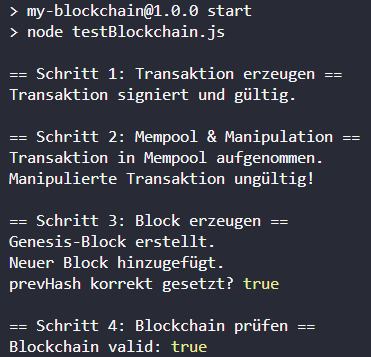

# Übung: Von der Transaktion zur Blockchain  
# Übung: Von der Transaktion zur Blockchain  

[](https://nodejs.org/)  
[](LICENSE)  
[](#)  
[](https://github.com/CrystalGalaxy777/my-blockchain-uebung1)

---


> **Hinweis / Note / Примечание:**  
> - **DE:** Dieses Repository ist eine **Übungsaufgabe** im Rahmen des Blockchain-Kurses.  
> - **EN:** This repository is an **exercise repo** for practicing blockchain basics.  
> - **RU:** Этот репозиторий — **учебный проект** для практики по блокчейну.


Ziel: **Von der Transaktion → über Mempool → in einen Block → zur Blockchain**.  
Dies ist ein *Exercise Repo* (Lern-Sandbox) und enthält auch **TODOs & Experimente**.  
Die saubere, portfolio-taugliche Version befindet sich im Projekt [`my-blockchain`](../my-blockchain).  


---

## 📌 Schritte

1. **Transaktion erzeugen**
   - Schlüsselpaar generieren  
   - Absenderadresse ableiten  
   - Transaktion mit Betrag `10` erstellen  
   - Transaktion signieren und überprüfen  

2. **Mempool**
   - Signierte Transaktion in den Mempool einfügen  
   - Manipulierte Transaktion (geänderter Betrag) wird abgelehnt  

3. **Block**
   - Genesis-Block erstellen  
   - Neuen Block mit der Transaktion aus dem Mempool hinzufügen  
   - `prevHash` prüfen  

4. **Blockchain**
   - Blockchain-Instanz erzeugen  
   - Block hinzufügen  
   - `isValid()` aufrufen und Ergebnis ausgeben  

---

## ▶️ Ausführung

Im Projektordner:

```bash
npm install
npm start
````

---

## 💡 Erwartete Konsolenausgaben

```
Transaktion signiert und gültig.
Manipulierte Transaktion ungültig!
Genesis-Block erstellt.
Neuer Block hinzugefügt.
prevHash korrekt gesetzt? true
Blockchain valid: true
```

*(Zusatz-Minicheck: Wenn man einen Block-Header verändert, liefert `isValid()` → `false`.)*

---

## 📂 Projektstruktur

```
my-blockchain-uebung1/
│── package.json
│── utils.js
│── transaction.js
│── mempool.js
│── block.js
│── blockchain.js
│── testBlockchain.js
│── README.md
```
---

## 💻 Beispielausgabe

So sieht die Konsolenausgabe aus:



---

## 🔍 Experimente mit TODOs

Im Code waren kleine TODO-Kommentare eingebaut. Sie dienen dazu, das Verhalten der Blockchain besser zu verstehen:

1. **Amount ändern (`transaction.js` / `testBlockchain.js`):**  
   - Wenn ich den Betrag (`amount`) ändere und die Transaktion **neu signiere**, bleibt sie gültig.  
   - Wenn ich den Betrag ändere, **ohne** neu zu signieren, wird die Signatur ungültig.  

2. **Nonce ausprobieren (`testBlockchain.js`):**  
   - Jede Kombination `(from, nonce)` darf nur einmal vorkommen.  
   - Zwei Transaktionen mit demselben `nonce` vom gleichen Absender → die zweite wird vom Mempool mit  
     ```
     { ok: false, reason: "Duplicate (from, nonce)" }
     ```  
     abgelehnt.  

3. **Blockchain manipulieren (`testBlockchain.js`):**  
   - Wenn ich z. B. den Timestamp im Block-Header ändere:  
     ```js
     newBlock.timestamp = 42;
     console.log("Blockchain valid nach Manipulation:", bc.isValid());
     ```  
   - Ergebnis:  
     ```
     Blockchain valid nach Manipulation: false
     ```  
   - Damit sieht man, dass jede Manipulation sofort die Validierung zerstört.  

4. **Genesis-Block (`blockchain.js`):**  
   - Timestamp/Nonce im Genesis-Block können beliebig gewählt werden.  
   - Die Blockchain bleibt gültig, solange alle folgenden Blöcke korrekt aufeinander verweisen.  

